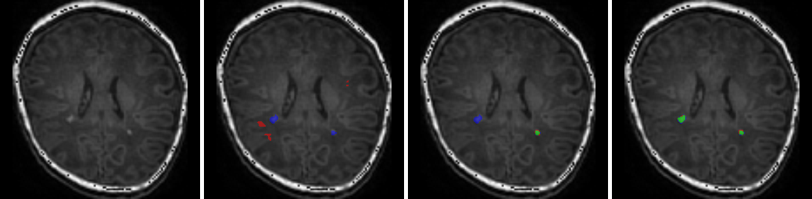
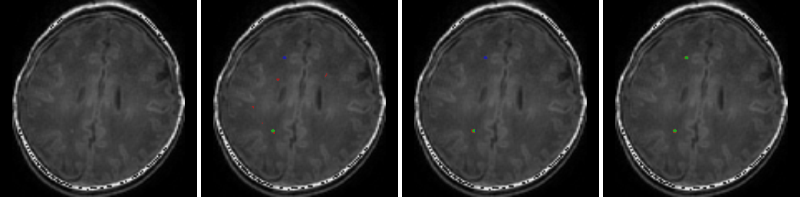

# Refined Segmentation R-CNN
A Deep Learning method to segment punctate white matter lesions (PWMLs); Brain tumor segmentation.  
**By:** Yalong Liu<sup>1</sup>, Jie Li<sup>1</sup>, Ying Wang<sup>1</sup>, Miaomiao Wang<sup>2</sup>, Xianjun Li<sup>2</sup>, Zhicheng Jiao<sup>3</sup>, Jian Yang<sup>2</sup>, Xingbo Gao<sup>1</sup>  
1. Lab of Video and Image Processing Systems, School of Electronic Engineering, Xidian University, Xi’an 710071, China  
2. Department of Radiology, The First Affiliated Hospital of Xi'an Jiaotong University, Xi’an 710061, China  
3. University of North Carolina at Chapel Hill, Chapel Hill, NC 27599, USA


**This repository includes:**  
1.T1WI of 10 patients for test(Full dataset is not allowed to be made public)  
2.Full code for model training and inference   
3.The link of pre-trained weights on google drive   

## Requirements
Python 3.6.3  
Tensorflow-gpu 1.12.0  
CUDA 9.0  
## Getting Started
1.Download the repositories and [weights](https://anonfiles.com/I2xeTaS5m1/model_enhancedrpn_enlargeroi1.3_segnet_crf_pwml_98765_h5).  
2.Choose a mode in the main.py('inference' or 'training').  
3.Change parameters in configs.py according to the comment  in the file.  
Enjoy!

## Acknowledgment
This repo borrows tons of code from  
[matterport/Mask_RCNN](https://github.com/matterport/Mask_RCNN)  
## Results
Performance:  

Index|--------Original MRI--------|---------SOTA----------|-----Mask R-CNN------|-----Our Method--------
:--|:--:|:--:|:--:|:--:


&nbsp;8/77&nbsp;|
:--|:--:|
&nbsp;79/67&nbsp;|  
&nbsp;82/67&nbsp;|  
&nbsp;83/48&nbsp;|  
&nbsp;83/54&nbsp;|
&nbsp;83/80&nbsp;|

-----
### Citation
If you use Refined Segmentation R-CNN in your research, please cite the paper ([http://arxiv.org/abs/1906.09684](http://arxiv.org/abs/1906.09684)):
```
@article{Liu2019,
  title={Refined Segmentation R-CNN: A Two-stage Convolutional Neural Network for Punctate White Matter Lesion Segmentation in Preterm Infants},
  author={Yalong Liu, Jie Li, Ying Wang, Miaomiao Wang, Xianjun Li, Zhicheng Jiao, Jian Yang, Xingbo Gao},
  journal={arXiv preprint arXiv:1906.09684},
  year={2019}
}
```


